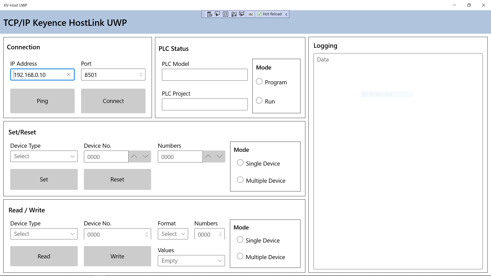

# KV-Host-UWP-C#

## Build Code

1. Start Microsoft Visual Studio and select **File** \> **Open** \> **Project/Solution**.
2. Double-click the Visual Studio Solution (.sln) file.
4. Press Ctrl+Shift+B, or select **Build** \> **Build Solution**.

## Run the code

To run this sample after building it, press F5 (run with debugging enabled) or Ctrl+F5 (run without debugging enabled) from Visual Studio. (Or select the corresponding options from the Debug menu.)


## GUI-Layout



## References
#### Adding Number Box in blank UWP Project
1. Right Click Manage NuGET Packages
2. Browse
    Microsoft.UI.Xaml
3. Install
4. Add following in App.Xaml
```
<Application.Resources>
    <XamlControlsResources xmlns="using:Microsoft.UI.Xaml.Controls" />
</Application.Resources>
```
5. Add following in MainPage.xaml
```
xmlns:muxc="using:Microsoft.UI.Xaml.Controls"
```
